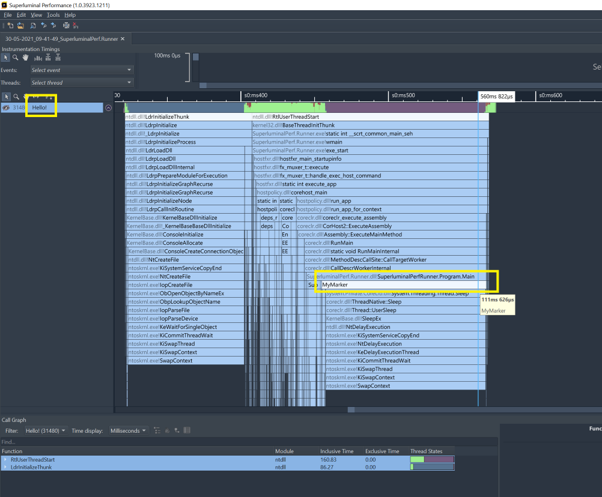

# SuperluminalPerf [](https://github.com/xoofx/SuperluminalPerf/actions/workflows/build.yml) [](https://www.nuget.org/packages/SuperluminalPerf/)


SuperluminalPerf is a small .NET managed wrapper around the [Superluminal PerformanceAPI](https://www.superluminal.eu/docs/documentation.html).

[Superluminal](https://www.superluminal.eu) is an outstanding profiler that supports .NET (Core, Framework) applications and provides mixed .NET and Native call stacks.

## Features

- One-to-One mapping with the native Superluminal PerformanceAPI (API Version `2.0`)
- Compatible with .NET 5.0
- Provides [binaries](#binaries) or [source embedding](#source-embedding) through a single NuGet package

## Usage

```c#
// Make sure to initialize Superluminal Performance API at the beginning of your app
SuperluminalPerf.Initialize();

// You can set the thread name
SuperluminalPerf.SetCurrentThreadName("Hello!");

// You can mark code with begin/end markers
SuperluminalPerf.BeginEvent("MyMarker");
Console.WriteLine("Hello World! Wait for 100ms");
Thread.Sleep(100);
SuperluminalPerf.EndEvent();
```

Running with Superluminal will produce the following markers:



## Binaries

SuperluminalPerf is available as a NuGet package: [](https://www.nuget.org/packages/SuperluminalPerf/)

## Source Embedding

SuperluminalPerf NuGet package comes with source included so that you can internalize your usage of SuperluminalPerf into your project. This can be useful in an environment where you can't easily consume NuGet references.

> WARNING: Currently, the sources are not set as readonly, so you should not modify sources in that mode as it will modify the sources for other projects using SuperluminalPerf on your machine. Use this feature at your own risks!

In order to activate this feature you need to:

- Set the property `PackageSuperluminalPerfIncludeSource` to `true` in your project:
  ```xml
  <PropertyGroup>
    <PackageSuperluminalPerfIncludeSource>true</PackageSuperluminalPerfIncludeSource>
  </PropertyGroup>
  ```
- Add the `IncludeAssets="Build"` to the NuGet PackageReference for SuperluminalPerf:
  ```xml
  <ItemGroup>
    <PackageReference Include="SuperluminalPerf" Version="1.0.0" IncludeAssets="Build"/>
  </ItemGroup>
  ```
## License

This software is released under the [BSD-Clause 2 license](https://opensource.org/licenses/BSD-2-Clause). 

## Credits

Adapted logo `performance` by [Sophia Bai](https://thenounproject.com/sophiabai/) from the Noun Project

## Author

Alexandre Mutel aka [xoofx](http://xoofx.com).
